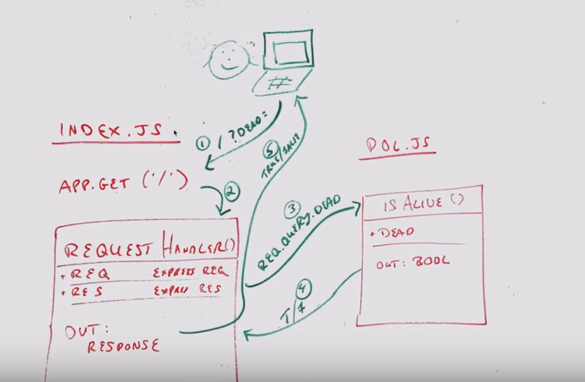

# LAB - 00

## Proof of Life Server

### Author: Student/Group Name

### Links and Resources
* [submission PR](https://github.com/Luke9389-career-track/lab-00/pull/1)
* [travis](https://www.travis-ci.com/Luke9389-career-track/lab-00)
* [front-end](https://luke9389-lab-00.herokuapp.com) (when applicable)

#### Documentation
* [jsdoc](https://luke9389-lab-00.herokuapp.com/docs/) (Server assignments)

### Modules
#### 'pos.js'
##### Exported Values and Methods

##### 'isalive(dead) -> boolean'
Return true/false to indicate how the server works

### Setup
#### `.env` requirements
* `PORT` - Port Number

**or, include an `.env.example`**

#### Running the app
* 'npm start'
* Endpoint: '/'
    * Returns a boolean
* Endpoint: '/docs'
    * Returns JSDoc Doc pages

#### Tests
* Unit Tests: 'npm test'
* Lint Tests: 'npm run lint'

#### UML

